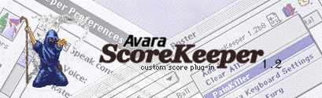
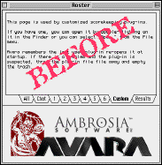
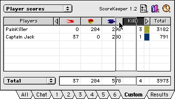
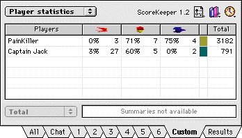

## What is ScoreKeeper?

ScoreKeeper is a free custom score plug-in for [Avara](https://github.com/avaraline/Avara/), a realtime 3D combat simulator for the Macintosh. The plug-in adds a new detailed scoreboard to the Roster window. ScoreKeeper features over a dozen different scores for each player and team. Along with score logging and the graphical user interface this plug-in is the best around! Read on for more information about the plug-in and its features...

## Features 

All scores are updated on-the-fly during the game. You may find it interresting to re-arrange the windows so both the Game and (part of) the Roster window are visible. This way you can keep track of the scores of your **opponents** or **teammates** during gameplay. When a game is finished you can compare your results to the other players and see how you've done.

The information in ScoreKeeper is devided into several **panels**. You can switch panels using the pop-up menu. The different panels are discussed on the ScoreKeeper panels page. Watch the scores and damage of the other players. Or analyse their hit statistic and see what weapons other players use best. You can also set a default score panel to switch to when a game starts.

You can set several ScoreKeeper options using the Preferences dialog. You can choose a **log file** in which ScoreKeeper will save the scores of all players after each game. The log file can have several formats and can be easily imported by other programs. With the color option, you can choose your **own H.E.C.T.O.R. colors** for all teams. Levels designers can make use of the ScoreKeeper Level Extension to change the team colors on a level by level basis. If you have installed the Speech Manager, ScoreKeeper will **speak console messages** out loud if you want to. This way you stay informed about what is happening in the game without reading the console. With the Movie option you can record the games you play, if the QuickTime extensions are installed.

In the **favorites menu** you can insert your favorite Avara **level sets**, **player files** and **keyboard settings**. These can easily be accessed by just **one click** of the mouse. When an item is selected ScoreKeeper will instantly open the file.

